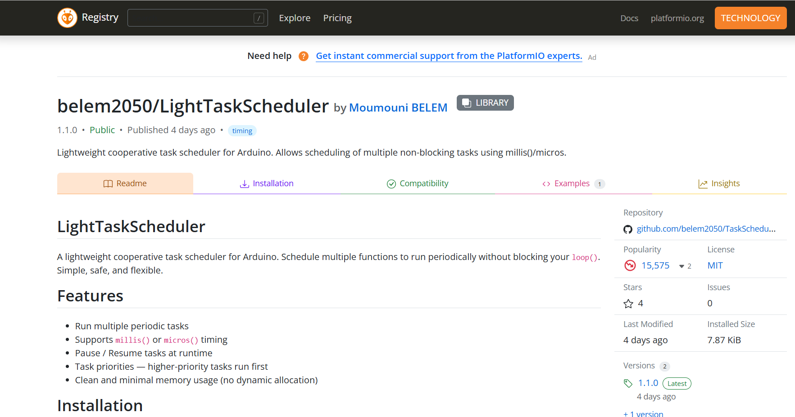
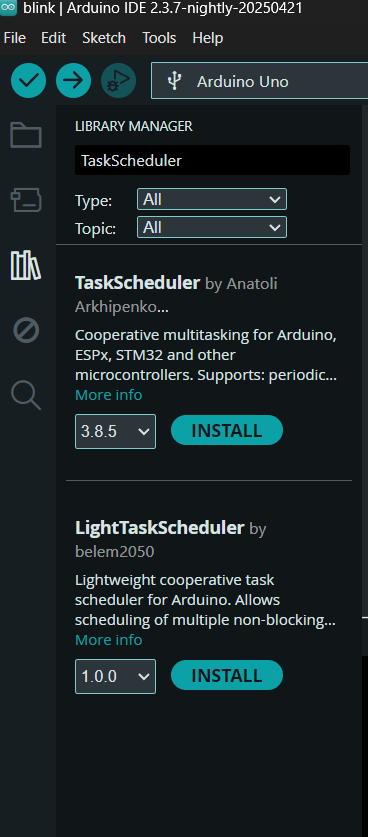

# LightTaskScheduler
A lightweight cooperative task scheduler for Arduino. Schedule multiple functions to run periodically without blocking your `loop()`. Simple, safe, and flexible.

## Features

- Run multiple periodic tasks
- Supports `millis()` or `micros()` timing
- Pause / Resume tasks at runtime
- Task priorities — higher-priority tasks run first
- Clean and minimal memory usage (no dynamic allocation)

## Installation

1. Clone or download this repository as a `.zip`
2. In the Arduino IDE: **Sketch → Include Library → Add .ZIP Library...**
3. Select the downloaded `.zip`

## 🚀 Getting Started

### Basic Blink Example

```cpp
#include <LightTaskScheduler.h>

TaskScheduler scheduler;

void blink1()
{
  digitalWrite(LED_BUILTIN, !digitalRead(LED_BUILTIN));
  Serial.println("blink1");
}

void blink2()
{
  Serial.println("blink2");
}

void blink3()
{
  Serial.println("blink3");
}

Task blinkTask1(blink1, 15000, false, 3); // run every 1000 ms

Task blinkTask2(blink2, 5000, false, 0); // run every 5000 ms

Task blinkTask3(blink3, 2000, false, 1); // run every 2000 ms

void setup()
{
  Serial.begin(9600);
  pinMode(LED_BUILTIN, OUTPUT);
  scheduler.addTask(&blinkTask1);
  scheduler.addTask(&blinkTask2);
  scheduler.addTask(&blinkTask3);

  blinkTask3.run(millis()); // a way to run once at start 
}

void loop()
{
  scheduler.run();
}
```

### Arduino/ Platform IO registries

<div style="display: flex; flex-wrap: wrap; gap: 10px; justify-content: center;">

  
  
</div>
